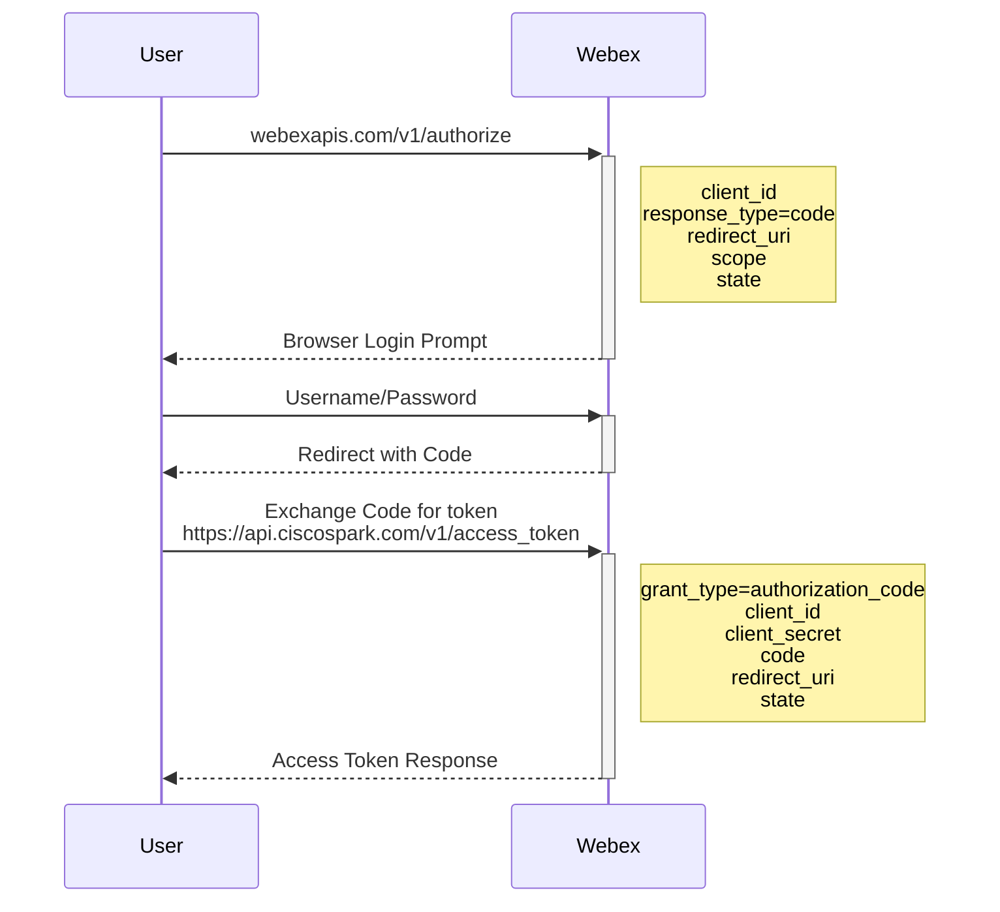
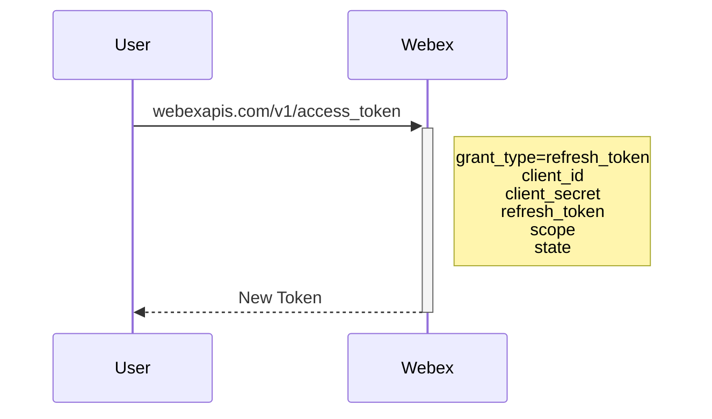

# WTR2 - Webex Token Retriever / Refresher

A small utility CLI for retrieving and subsequently refreshing an integration token from Webex.  

See the Webex documentation for further information on Webex Integrations and Authorization](https://developer.webex.com/docs/integrations)

## Simplified Sequence Diagram

### Retrieve

This command is used to obtain the initial token.

* `wtr retrieve`

### Refresh

This command is used to refresh a token before it expires using the details provided by Webex.  The details used to refresh the token are obtained by the initial token retrieval.

* `wtr refresh`

## Configuration

Information required to begin the process includes:

| Item          | Description                                  | YAML         | Env Var            |
|---------------|----------------------------------------------|--------------|--------------------|
| AppID         | Webex App ID for integration                 | appid        | WEBEX_APPID        |
| Secret        | Secret Associated to the App ID              | secret       | WEBEX_SECRET       |
| Scopes        | Required Scopes as configured for the App ID | scopes       | WEBEX_SCOPES       |
| Redirect Port | Local port to retrieve responses             | redirectPort | WEBEX_REDIRECTPORT |

There are a couple of default values:

| Item          | Default                                                                                                                                                      |
|---------------|--------------------------------------------------------------------------------------------------------------------------------------------------------------|
| Scopes        | meeting:recordings_read spark:kms meeting:schedules_read meeting:preferences_write meeting:recordings_write meeting:preferences_read meeting:schedules_write |
| Redirect Port | 6855                                                                                                                                                         |

Note that the scopes would still need to be configured in the webex developer portal for your integration.